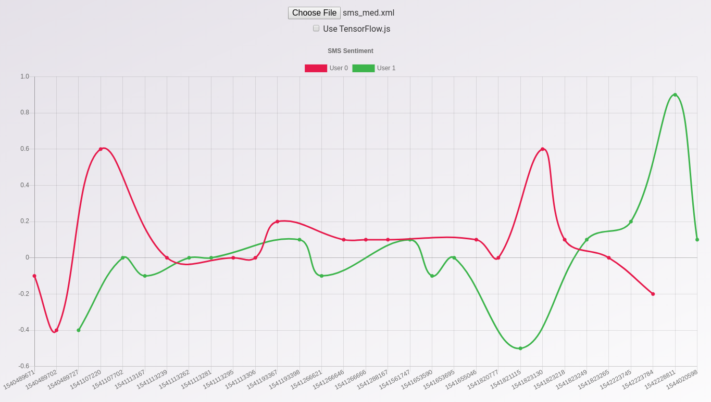
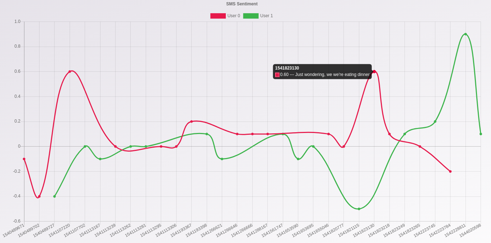

# SMS Sentiment - Analyse a SMS conversation to determine sentiment over time 
### Using Chart.js, Express.js, TensorFlow.js, Google's Natural Langauge API, fast-xml-parser and more.

# Setup

Optional to use Natural Language API: https://cloud.google.com/natural-language/docs/quickstart-client-libraries 

`export GOOGLE_APPLICATION_CREDENTIALS="[PATH]"`

````
npm install
````
# Usage

```
npm start
localhost:3000
```

- Install [SMS Backup & Restore](https://play.google.com/store/apps/details?id=com.riteshsahu.SMSBackupRestore&hl=en_US)
 
- Back up now > Check "Messages" only > Advanced options > Selected coversations only (select one conversation) > Turn off "Media, pictures ect"

- Upload the file you exported or one of the test SMS files in test_sms_data

----------------------------
# Screenshots



